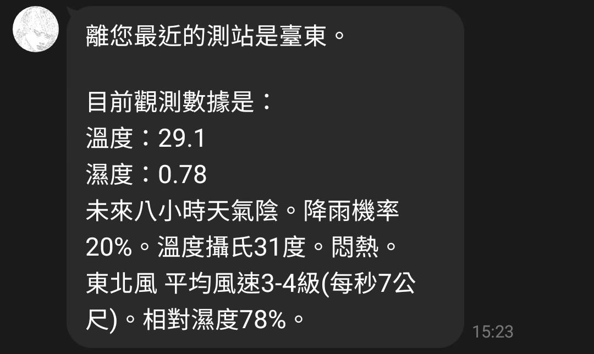

# Si manglam 的 Line Bot

這是一個利用 Python 嘗試將 Line 聊天室與 LaTeX 連起來的計畫。

目前提供：

1. 即時天氣數據與未來八小時預報
2. 學校**當日**三餐查詢
3. LaTeX 語法偵測並回傳圖片

## 公告

目前機器人因為沒有伺服器所以無法使用，此外整個機器人正在用 Literate Programming 重寫中。

## 使用

請掃以下 QR Code


向機器人傳送**位置資訊**即可得到以下回覆：



若傳送均一（早餐／午餐／晚餐）即可查尋當日早午晚餐

若訊息以 LaTeX 關鍵字 $ 或 \\( 或 \\[ 開頭，機器人會自動偵測並回傳編譯出的圖片。

如果訊息以 .tex 開頭就會被視為調整 LaTeX Preamble 的命令，目前提供了以下命令：

```
> .tex 
強制將後面的訊息送入 LaTeX 編譯

> .tex show 
將目前使用的 Preamble 以訊息的方式回傳給使用者

> .tex new
為使用者定義一個新的 Preamble

> .tex insert <參數>
將參數加入 Preamble 的最後一行

> .tex replace <參數1> <參數2>
將參數1替換成參數2

> .tex delete preamble
刪除自定義 Preamble
```

## 下載與 Deploy

善待完善中

## 已知問題

1. 如果想要在 Linux 上部署這個機器人，會需要將 `insert_preamble()`與 `replace_preamble` 內的 `sed` 命令修正，因為 Linux 系統上的 `sed` 與 Mac 上的有著些許不同。
2. 若在沒有自定義 Preamble 的情況下輸入 `.tex insert` 會導致機器人罵髒話。
3. 這台機器人過於依賴外部命令，例如 `xelatex` 與 `cat` 還有 `sed` 所以導致建立環境變的很複雜。
4. 機器人的控制邏輯是請函數 return 其他函數建立起來的，所以需要一一看完函數的定義才能理解控制邏輯。
5. 大部分的 Funtion 都是 Impure。
6. 不論查詢的是早午晚餐，機器人一率回答今天的晚餐是什麼。

## 聯絡我

Email: qwer09214@gmail.com

## 延伸閱讀

解說手冊（施工中）